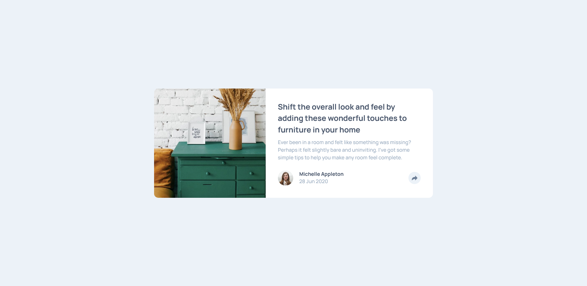

# Frontend Mentor - Article preview component solution

This is a solution to the [Article preview component challenge on Frontend Mentor](https://www.frontendmentor.io/challenges/article-preview-component-dYBN_pYFT). Frontend Mentor challenges help you improve your coding skills by building realistic projects. 

## Table of contents

- [Overview](#overview)
  - [The challenge](#the-challenge)
  - [Screenshot](#screenshot)
  - [Links](#links)
- [My process](#my-process)
  - [Built with](#built-with)
  - [What I learned](#what-i-learned)
- [Author](#author)

## Overview

### The challenge

Users should be able to:

- View the optimal layout for the component depending on their device's screen size
- See the social media share links when they click the share icon

### Screenshot

### Links

- Live Site URL: [https://polthm.github.io/article-preview-component/](https://polthm.github.io/article-preview-component/)

## My process

HTML then SASS (but first start with a nice SASS base) and a small amount of JS.
I also took care of the web accessibility.

### Built with

- HTML
- SASS
- A small amount of JS

### What I learned

To use the BEM methodology correctly, work with a powerful SASS architecture (with very useful mixins and variables), 
and work with JS and css transition to create nice animations.

## Author

- Website - [https://pol-thomas.com/](https://pol-thomas.com/)
- Frontend Mentor - [@PolThm](https://www.frontendmentor.io/profile/PolThm)
